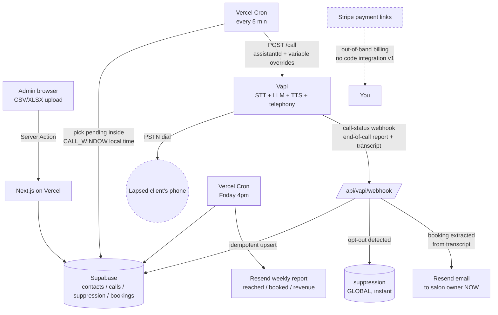

# ARCHITECTURE.md — Win-Back Pipeline (v1)
Companion to BRIEF.md. This is the system shape, latency budget, and QoS rules.
If a decision here conflicts with elegance, this file wins.

## 1. SYSTEM DIAGRAM

## 2. VOICE TURN LATENCY BUDGET (the only latency that matters)
Target: caller stops speaking -> Malone starts speaking in <= 900ms. Hard fail > 1.5s.

| Stage                          | Budget    | How we hit it                                  |
|--------------------------------|-----------|------------------------------------------------|
| STT endpoint (Deepgram class)  | ~150-300ms| Vapi default streaming STT, no changes         |
| LLM time-to-first-token        | ~200-400ms| SMALL fast model (gpt-4o-mini / Haiku class).  |
|                                |           | System prompt < 400 tokens. No RAG. No KB.     |
| TTS time-to-first-audio        | ~150-300ms| Streaming TTS voice; pick a low-latency voice  |
|                                |           | in Vapi, not the fanciest one                  |
| **Mid-call tool calls**        | **0ms**   | **FORBIDDEN. No function calling during the**  |
|                                |           | **call. Booking is spoken, then extracted**    |
|                                |           | **from transcript in the webhook (async).**    |

Config notes for Claude Code:
- Enable Vapi backchanneling/filler ("mm-hm", "got it") to mask any residual gap.
- Keep Malone's replies short by prompt design (see BRIEF.md persona): short
  output = fast turns = the "straight flows" feel.
- Use Vapi end-of-call structured-data/summary to pull {slot, outcome, opt_out}
  server-side. Zero live-call cost.

## 3. WEB/APP LATENCY (don't optimize, just don't break)
- Upload parse client-side (SheetJS) -> single batched insert. No row-by-row.
- Cron batch: claim rows with a single UPDATE ... RETURNING (skip-locked
  semantics) so concurrent crons never double-dial. This is the ONE clever query
  allowed in the codebase.
- Concurrency cap: <= 8 simultaneous Vapi calls (default plan is 10 lines;
  leave headroom).

## 4. QUALITY OF SERVICE RULES
- Webhook is idempotent: upsert keyed on vapi_call_id. Vapi may retry deliveries.
- Every call writes a row even on failure (outcome = no_answer / failed / busy).
  Unlogged calls are bugs.
- One dial attempt per contact per campaign. Ever. Enforced by status check in
  the claim query, not by application memory.
- Opt-out path is synchronous and global: webhook -> suppression insert ->
  contact status update, same transaction.
- Compliance gates (consent=true, suppression check, CALL_WINDOW, disclosure
  line in persona) are code-level guards, not conventions. Write the 4 unit
  tests for the scrub function; skip tests elsewhere in v1.
- Recordings/transcripts: store Vapi URLs only; review 5 calls/day manually the
  first two weeks. Prompt fixes > code fixes.

## 5. WHAT "SOTA" MEANS IN v1 (and what it doesn't)
IN:  sub-second voice turns, streaming everything, idempotent webhooks,
     zero fixed cost, one clever claim-query.
OUT: queues, Redis, microservices, realtime dashboards, multi-region,
     observability platforms, feature flags. v1 observability = Supabase
     table + Vercel logs. Delete this line item from any plan that includes it.

## 6. BUILD ORDER (unchanged from BRIEF.md)
Upload -> Scrub (gates + tests) -> Claim/dial via cron -> Webhook -> Booking
email -> Friday report -> one-page marketing site. One slice at a time, commit
per slice, demo call to my own phone before slice 5.
